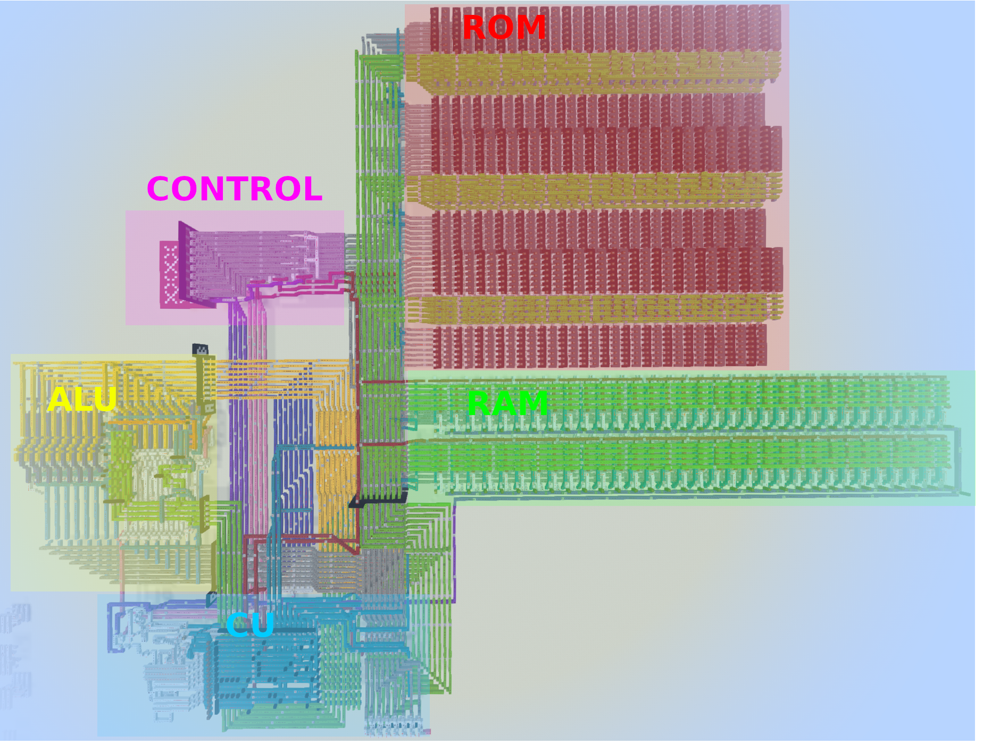
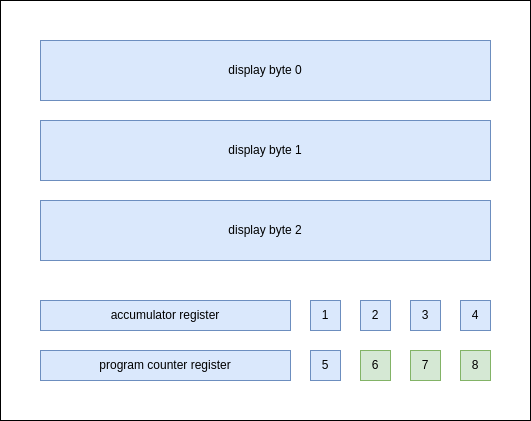
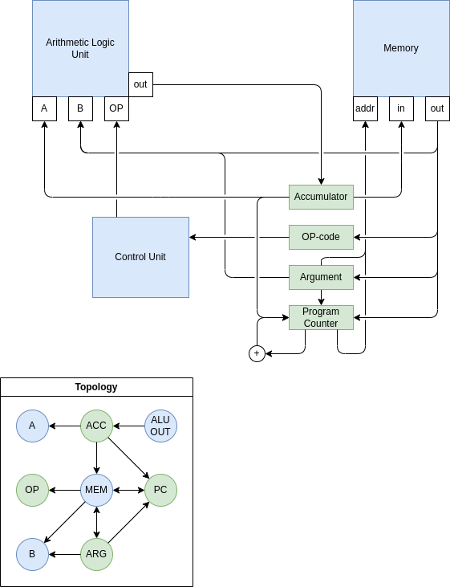

# block-game-computer
A simple 8-bit processor implemented in Minecraft redstone.

Map:

## Specifications
* Accumulator architecture.
* 16-bit instructions.
* 64 bytes of R/W memory (RAM).
* 192 bytes of programmable read-only memory (ROM). (Up to 96 program instructions.)
* 3-byte display.
* 8-bit ALU with 2's complement arithmetic.

## Operation
**Programming.** The computer is programmed by pulling levers directly in the ROM banks to set the correct memory configuration. The program counter starts at memory address `0100 0000` (lower left corner in the "ROM" area in the map), so this is where the program should start. Each instruction spans two bytes, but even starting addresses is not enforced. The ROM may store both program and any constant data that the program might need. An easy way to have several programs stored in the computer simultaneously is to let the first instruction be a jump instruction which you may then change depending on which program you want to run.

**Execution.** When the ROM has been configured with a program, the computer is ready to execute it. The execution is controlled and monitored from the user interface labeled "CONTROL" in the map. The layout of the interface is displayed in the figure below:

* **display byte 0-2**: The three write-only bytes are displayed here.
* **accumulator register**: The current value of the accumulator register is displayed here.
* **program counter register**: The current value of the program counter register is displayed here.
* **(1) ALU-overflow**: Lights up if the ALU overflow bit is high.
* **(2) STOP-await**: Lights up if a STOP signal has been sent but not yet recieved. Execution will stop at the end of the ongoing cycle. The bit is cleared when execution stops. Also clears when sending a RUN signal.
* **(3) Accumulator true**: Lights up if the accumulator has any high bit, which is the condition for all conditional operations.
* **(4) Reset done**: Blinks when reset has been completed.
* **(5) HALT**: Lights up when execution has halted by a HALT operation.
* **(6) STOP**: Sends a STOP signal which will stop execution before the next cycle.
* **(7) RUN**: Starts execution from the current state. Note that execution cannot start if the CP points at a HALT instruction.
* **(8) RESET**: Resets the computer to the default state. (Sets CP to `0100 0000`; zeroes the OP-, accumulator-, and display registers; and zeroes the RAM.)

Typically, running a program requires the following actions:
1. Programming the ROM.
2. Sending a RESET signal.
3. Sending a RUN signal.
4. Waiting for a very long time as the computer computes.
 
## Instruction set
Each instruction consists of two bytes: one OP-code and an argument. The following operations are available:
| **opcode**  | **name** | **argument** | **description**                                                                                  |
|-------------|----------|--------------|--------------------------------------------------------------------------------------------------|
| `0000_0000` | NOP      | N/A          | Does nothing.                                                                                    |
| `0000_0001` | HALT     | N/A          | Halts execution.                                                                                 |
| `0000_1001` | JUMP     | address      | Sets the PC to the given address.                                                                |
| `0000_1010` | JUMPIF   | address      | Sets the PC to the given address IF the accumulator has any high bit.                            |
| `0000_1101` | JUMPW    | N/A          | Sets the PC to the value of the accumulator register.                                            |
| `0000_1110` | JUMPIFF  | address      | Sets the PC to the value of the memory at the given address if the accumulator has any high bit. |
| `0001_0000` | STORE    | address      | Stores the value of the accumulator register at the given memory address.                        |
| `0001_0001` | MOVE     | value        | Sets the accumulator register to the given value.                                                |
| `0001_0010` | READ     | address      | Sets the accumulator register to the value of the memory at the given address.                   |
| `1000_0000` | ADD      | value        | Adds the given value to the accumulator.                                                         |
| `1000_0001` | SUB      | value        | Subtracts the given value from the accumulator.                                                  |
| `1000_0010` | NEG      | N/A          | Arithmetic negation of the value of the accumulator.                                             |
| `1000_1000` | AND      | value        | Sets the accumulator to the bitwise AND of the given value and itself.                           |
| `1000_1001` | OR       | value        | Sets the accumulator to the bitwise OR of the given value and itself.                            |
| `1000_1010` | NOT      | N/A          | Bitwise negation of the value of the accumulator.                                                |
| `1000_1011` | XOR      | value        | Sets the accumulator to the bitwise XOR of the given value and itself.                           |
| `1001_0000` | LSHIFT   | N/A          | Logic left shift of the accumulator.                                                             |
| `1001_0001` | LASHIFT  | N/A          | Arithmetic left shift of the accumulator.                                                        |
| `1001_0010` | RSHIFT   | N/A          | Logic right shift of the accumulator.                                                            |
| `1001_0011` | RASHIFT  | N/A          | Arithmetic right shift of the accumulator.                                                       |
| `1001_0100` | LROT     | N/A          | Rotates the accumulator to the left.                                                             |
| `1001_0110` | RROT     | N/A          | Rotates the accumulator to the right.                                                            |
| `1010_0000` | ADDF     | address      | Same as ADD but reads the value from the given memory address.                                   |
| `1010_0001` | SUBF     | address      | Same as SUB but reads the value from the given memory address.                                   |
| `1010_1000` | ANDF     | address      | Same as AND but reads the value from the given memory address.                                   |
| `1010_1001` | ORF      | address      | Same as OR but reads the value from the given memory address.                                    |
| `1010_1011` | XORF     | address      | Same as XOR but reads the value from the given memory address.                                   |

(This instruction set is not a _good_ choice of instructions by any measure, I didn't think a lot about it.)

## Address space
The computer operates with 256 memory addresses:
| **address range**       | **function**      | **type** |
|-------------------------|-------------------|----------|
| `0000_0000`-`0011_1111` | RAM               | R/W      |
| `0100_0000`-`1111_1111` | ROM               | R        |
| `1000_0000`-`1000_0010` | display registers | W        |

(R: accessable for read operations, W: accessable for write operations.)

Note that the display registers' address space overlap with the ROM's address space.

## Architecture
The computer uses an 8-bit accumulator architecture. It has an 8-bit ALU (Arithmetic Logic Unit) with a [Kogge Stone adder](https://en.wikipedia.org/wiki/Kogge%E2%80%93Stone_adder) that performs arithmetic and logic operations with one (A) or two (A, B) operands of which one (A) is always the value of the accumulator register (ACC). Execution is controlled by the Control Unit (CU) which triggers internal functions in sequence to perform the require manipulations of the computer state depending on the current opcode and possible user signals. The computer does not operate on a constant clock frequency and instead uses a variable cycle time depending on the operation. This allows for faster execution since different operations take different time to complete.

There are four registers used by the computer:
* The accumulator register (ACC) that has already been described.
* The OP-register (OP) which stores the opcode of the current instruction.
* The argument register (ARG) which stores the argument of the current instruction.
* The program counter register (PC) which stores the memory address of the current byte of the current instruction.

The ACC- and PC-registers are viewable from control interface.

The PC-register has its own adder circuit which means that the next address can be computed while the ALU is used for computation.

The following figure shows an overview of the architecture of the computer:

## 
